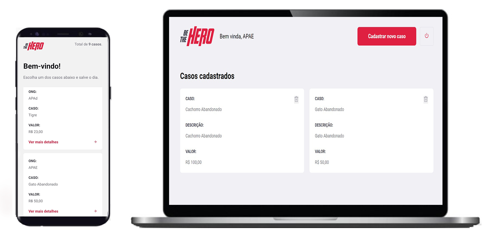

<h1 align="center">
  
</h1>

<h3 align="center">
  Be The Hero - Conecte sua ONG a pessoas que desejam ajudar.
</h3>

<p align="center">
  
  
  
  
  <a href="https://www.codacy.com/manual/engividal/tobehero?    utm_source=github.com&amp;utm_medium=referral&amp;utm_content=engividal/tobehero&amp;utm_campaign=Badge_Grade">
  
  </a>
  
  
  
  <a href="https://github.com/engividal/tobehero/commits/master">
    
  </a>
  
  <a href="https://github.com/engividal/tobehero/issues">
    
  </a>
  
  
</p>

<p align="center">
  <a href="#%EF%B8%8F-projeto">Projeto</a>&nbsp;&nbsp;&nbsp;|&nbsp;&nbsp;&nbsp;
  <a href="#-tecnologias">Tecnologias</a>&nbsp;&nbsp;&nbsp;|&nbsp;&nbsp;&nbsp;
  <a href="#-semana-omnistack">Semana OmniStack</a>&nbsp;&nbsp;&nbsp;|&nbsp;&nbsp;&nbsp;
  <a href="#-instalação-execução-e-desenvolvimento">Instalação, execução e desenvolvimento</a>&nbsp;&nbsp;&nbsp;|&nbsp;&nbsp;&nbsp;
  <a href="#-como-contribuir">Como contribuir</a>&nbsp;&nbsp;&nbsp;|&nbsp;&nbsp;&nbsp;
  <a href="#-licença">Licença</a>
</p>

<p id="insomniaButton" align="center">
  <a href="https://insomnia.rest/images/run.svg)](https://insomnia.rest/run/?label=Tobehero%20API&uri=https%3A%2F%2Fraw.githubusercontent.com%2Fengividal%2Ftobehero%2Fmaster%2Finsomnia.json" target="_blank"></a>
</p>



## 📋 Projeto

Aplicação completa utilizando a Stack do Javascript. O objetivo da aplicação é permitir que ONGs possam cadastrar casos a serem visualizados pelo possíveis voluntários que queiram colaborar. 

O Frontend Web permite o cadastro de novas ONGs e novos Casos pela interface web. Os casos possuem detalhes para auxiliar quem tiver interesse em ajudar e entrar em contato com as ONGs.

O aplicativo é voltado para o usuário final, possível voluntário, que poderá visualizar todos os casos disponíveis e entrar em contato com a organização que criou o caso.  

## 🔝 Tecnologias

Esta aplicação foi desenolvida com as tecnologias abaixo:

- [Node.js](https://nodejs.org/en/)
- [ReactJS](https://reactjs.org/)
- [React Native](https://reactnative.dev/)
- [Expo](https://expo.io/)
- [Express](https://expressjs.com/pt-br/)
- [Celebrate](https://github.com/arb/celebrate)
- [SQLite](https://www.sqlite.org/)
- [Jest](https://jestjs.io/)
- [SuperTest](https://github.com/visionmedia/supertest)
- [Nodemon](https://nodemon.io/)
- [React Navigation](https://reactnavigation.org/)
- [React Icons](https://react-icons.netlify.com/#/)
- [Axios](https://github.com/axios/axios)

##  Semana OmniStack

A [Semana OmniStack](https://rocketseat.com.br/week/inscricao/11.0) é um evento 100% online e gratuito, onde a [Rocketseat](https://github.com/rocketseat) junto com seu CTO [Diego Fernandes](https://github.com/diego3g) e mais toda a comunidade, desenvolvem uma aplicação completa, desde o banco de dados, back-end, até o front-end web e mobile, tudo isso utilizando a stack JavaScript, ou seja, Node.js no back-end, ReactJS para web e React Native para mobile.

## 💻 Instalação e execução

Faça um clone do repositório através do [GitHub Desktop](https://desktop.github.com/) ou linha de comando `git clone https://github.com/engividal/tobehero.git`.

### Pré-requisitos

- [Node.js](https://nodejs.org/en/)
- [SQLite](https://www.sqlite.org/)
- [Yarn](https://yarnpkg.com/) ou [npm](https://www.npmjs.com/)
- [Expo](https://expo.io/)

### Backend

- A partir da raiz do projeto, entre na pasta rodando `cd backend`;
- Rode `yarn` para instalar sua dependências;
- Importe o arquivo `Insomnia.json` no Insomnia ou clique no botão [Run in Insomnia](#insomniaButton);

### Web

_ps: Antes de executar, lembre-se de iniciar o backend deste projeto_

- A partir da raiz do projeto, entre na pasta do frontend web rodando `cd web`;
- Rode `yarn` para instalar as dependências;
- Rode `yarn start` para iniciar o client web;

### Mobile

_ps: Antes de executar, lembre-se de iniciar o backend deste projeto_

- A partir da raiz do projeto, entre na pasta do frontend web rodando `cd mobile`;
- Rode `yarn` para instalar as dependências;
- Rode `yarn start` ou `expo start` para iniciar o bundle com o expo;
- Caso vá utilizar seu smartphone, com o app do expo escaneia o QRCODE;

## ❤️ Como contribuir

**Faça um fork deste repositório**

<!-- - Faça um fork desse repositório;
- Cria uma branch com a sua feature: `git checkout -b minha-feature`;
- Faça commit das suas alterações: `git commit -m 'feat: Minha nova feature'`;
- Faça push para a sua branch: `git push origin minha-feature`; -->

```bash
# Clone o seu fork
$ git clone url-do-seu-fork && cd tobehero

# Crie uma branch com sua feature
$ git checkout -b minha-feature

# Faça o commit das suas alterações
$ git commit -m 'feat: Minha nova feature'

# Faça o push para a sua branch
$ git push origin minha-feature
```

Depois que o merge da sua pull request for feito, você pode deletar a sua branch.

## 📝 Licença

Esse projeto está sob a licença MIT. Veja o arquivo [LICENSE](https://github.com/engividal/tobehero/blob/master/LICENSE) para mais detalhes.

---

## 🙏 Agradecimentos 

<p>CTO Rocketseat [Diego Fernandes](https://github.com/diego3g)</p>
<p>Rocketseat pela semana de Aprendizagem [Rocketseat](https://github.com/rocketseat)</p>
<p>Template do README.md [EliasGcf](https://www.linkedin.com/in/eliasgcf/)</p>
<p>Apoio na geração das telas [Sth](https://www.linkedin.com/in/sthefany-freitas-9130991a3/)</p>

